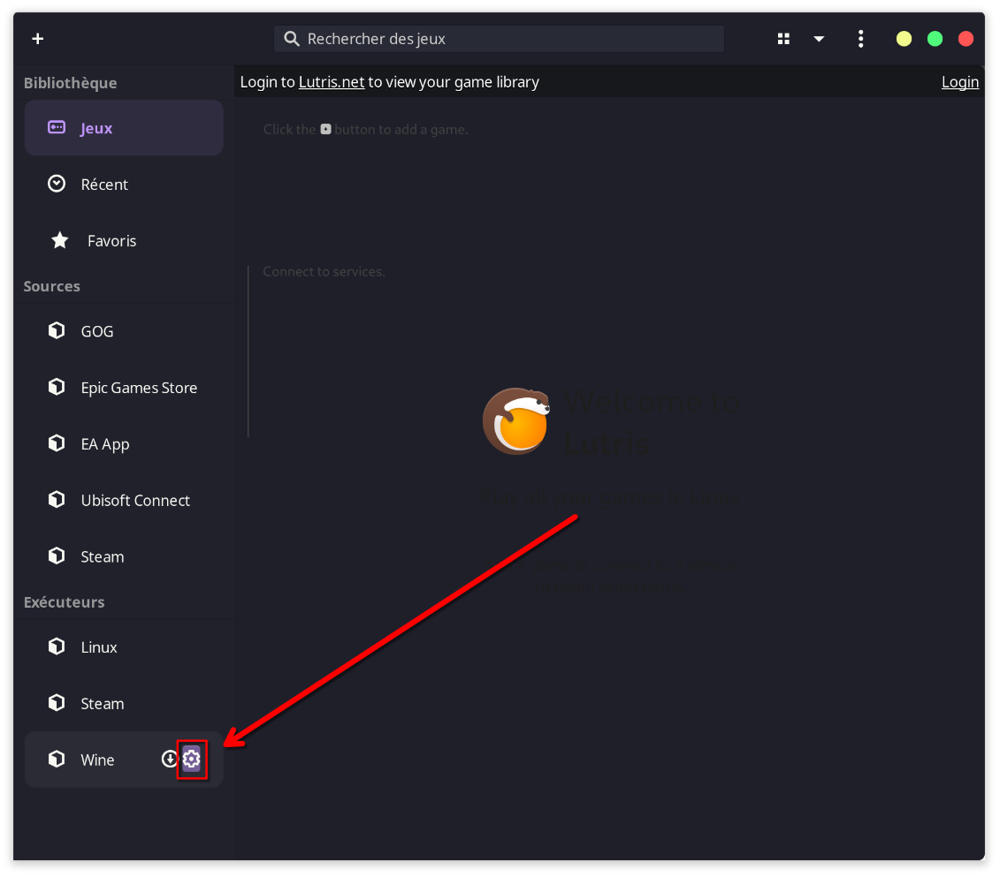
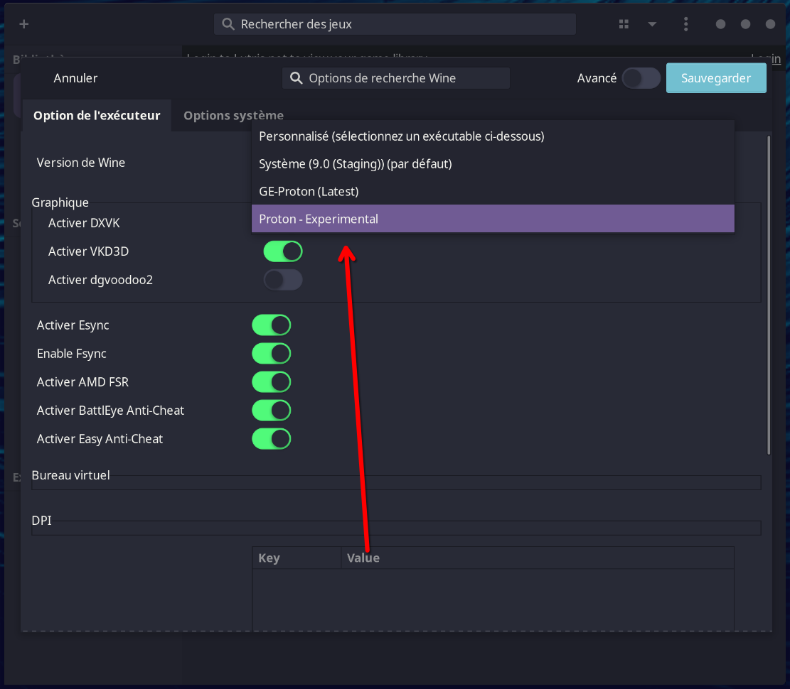
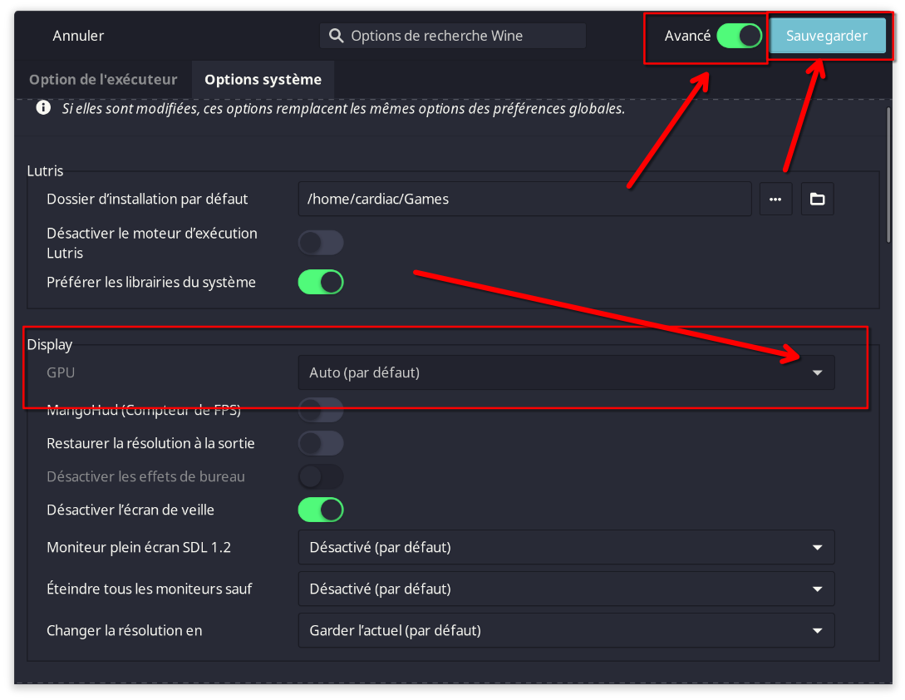
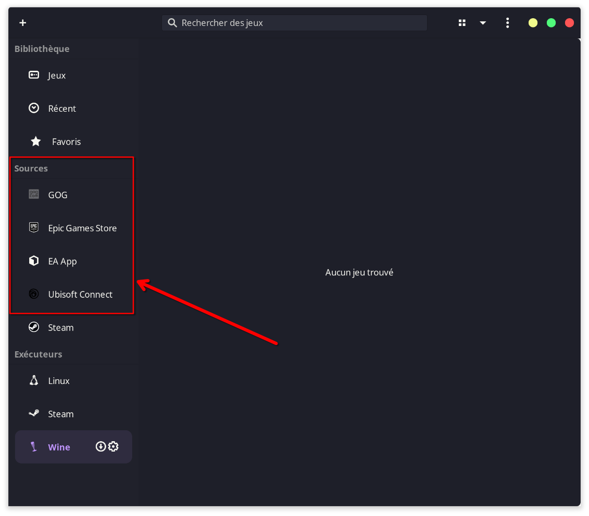
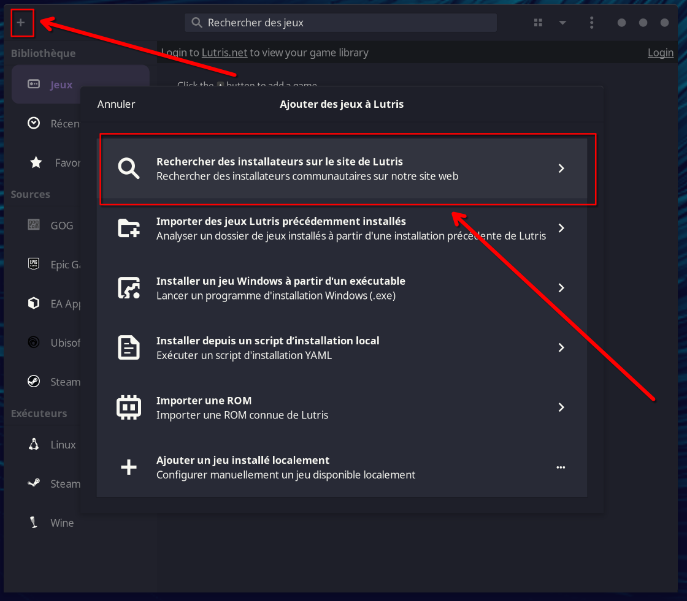
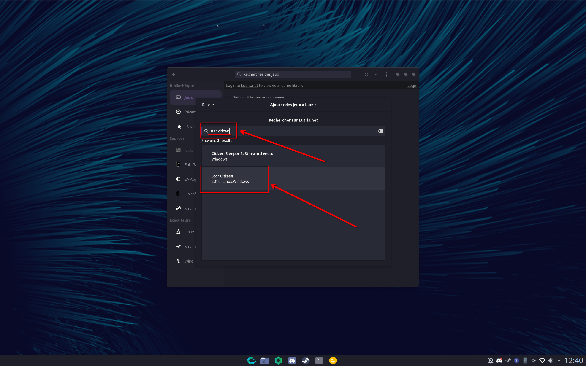

### Introduction à Lutris

> [!WARNING]
> En attendant que les devs mettent à jour et simplifient Lutris, je trouve bien plus simple Heroic Game Launcher : [GUIDE HGL](https://github.com/Cardiacman13/guide-heroic)

Lutris est une plateforme open-source de gestion de jeux sur Linux. Elle permet d'installer, de configurer et de lancer des jeux provenant de différentes sources, telles que Steam, GOG, Humble Bundle, et même des émulateurs pour les jeux rétro. Lutris offre un support étendu pour les jeux natifs Linux, les jeux Windows via Wine/Proton, ainsi que divers émulateurs pour consoles. C'est un outil essentiel pour les joueurs sous Linux, offrant une interface centralisée et simplifiée pour gérer tous vos jeux en un seul endroit.

Cependant, la mise en place de Lutris peut varier en fonction de la distribution Linux que vous utilisez. Certaines distributions comme **[Nobara](https://nobaraproject.org/download-nobara/)** ou **[Bazzite](https://bazzite.gg/)**, qui sont spécifiquement orientées vers le gaming, préinstallent Lutris et Steam avec une configuration optimisée. Cela facilite grandement l'utilisation de Lutris sans nécessiter d'efforts supplémentaires. 

En revanche, pour d'autres distributions, des actions supplémentaires peuvent être nécessaires pour que Lutris fonctionne correctement. Il est important de consulter la documentation officielle de Lutris pour s'assurer que vous avez installé toutes les dépendances nécessaires et les pilotes appropriés. Vous pouvez trouver ces informations sur les pages suivantes :

- **[Dépendances Wine](https://github.com/lutris/docs/blob/master/WineDependencies.md)**
- **[Installation des pilotes](https://github.com/lutris/docs/blob/master/InstallingDrivers.md)**

### Guide Lutris

#### 1. Passer sur Proton Expérimental

La première chose à faire est de configurer Lutris pour utiliser **Proton Expérimental**, une version de Proton qui intègre les dernières améliorations et correctifs. Pour ce faire, installez Steam en suivant [ce guide](https://codeberg.org/Gaming-Linux-FR/steam-post-install). Ensuite, dans les paramètres de Wine :

Sélectionnez Proton Expérimental dans le champ `version de Wine`. A noter qu'il peut être nécessaire de redémarrer Lutris après sa première initialisation pour que le choix de proton experimental soit visible.

#### 2. Forcer l'utilisation du GPU dédié

Si vous utilisez un ordinateur portable ou même un PC de bureau équipé de deux GPU (un intégré et un dédié), il est recommandé de forcer Lutris à utiliser le GPU dédié pour les jeux. Cela garantit de meilleures performances graphiques et une meilleure compatibilité.

#### 3. Installation de Launchers

Lutris facilite l'installation de nombreux launchers de jeux populaires en un seul clic. Il vous suffit de sélectionner le launcher que vous souhaitez installer dans la liste des options disponibles.

#### 4. Recherche de Jeux ou Launchers

Pour les jeux ou les launchers non répertoriés dans la liste principale, vous pouvez utiliser l'outil de recherche de Lutris pour les trouver et les installer. Lutris propose une large base de données de scripts d'installation créés par la communauté, permettant de configurer et de lancer presque n'importe quel jeu sur Linux.

### Conclusion

Lutris est un outil puissant et flexible qui peut grandement améliorer votre expérience de jeu sous Linux, en simplifiant la gestion des jeux et en offrant des options de configuration avancées pour s'assurer que vos jeux fonctionnent de manière optimale. Toutefois, en fonction de votre distribution Linux, une configuration supplémentaire pourrait être nécessaire pour tirer le meilleur parti de Lutris. N'hésitez pas à consulter les documents liés ci-dessus pour une installation réussie.
